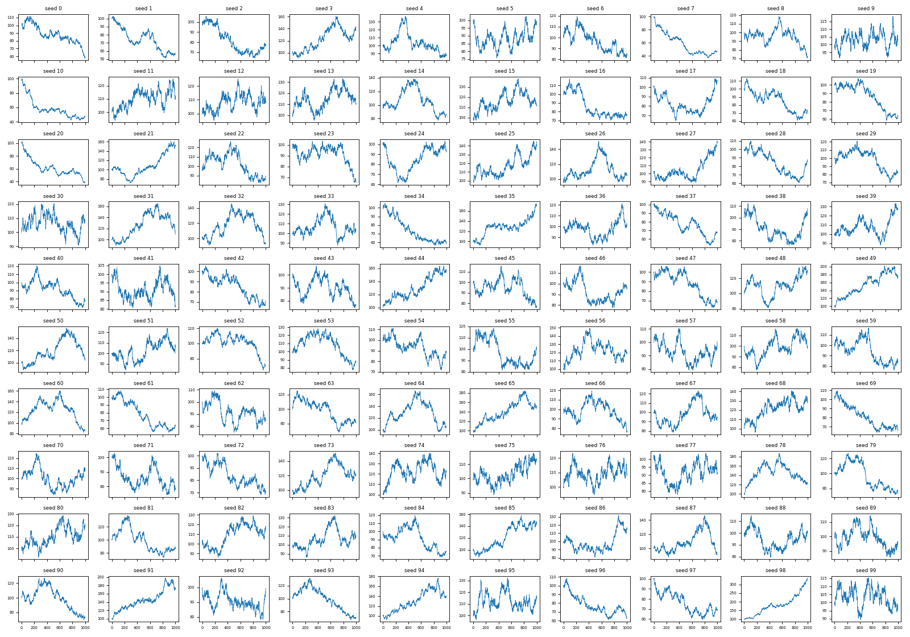

# TRIE: Trading Recursive Intelligence Environment

See [Plan.md](Plan.md) for the full project idea.

## Learning Process

1. We built a 100 stocks ad hoc data to work on a baseline model.

   

2. We're using the 0/1 DP logic of either taking a share or not, to build the baseline model. For now it's only 1 share for each stock, and we haven't considered how many shares to buy from each stock.

3. We ran the baseline on all 100 fake charts ([experiment_ab.py](experiment_ab.py), raw numbers in `results_ab.csv`). The rule: hold the stock if today's price is above its 20-day average, otherwise hold nothing. Each buy or sell costs 0.1%. We compared it to two yardsticks: buy-and-hold, and never trading (always 0 profit).

   | Average over 100 charts | Moving-average strategy | Buy and hold |
   |---|---|---|
   | Total return | -12.2% | -0.1% |
   | Charts that made money | 24 of 100 | 44 of 100 |
   | Sharpe | -0.32 | -0.01 |

   Other numbers for the strategy: it was invested about 48% of the days, made about 126 trades per chart, and paid about 12.6% of its money in trading costs. It beat buy-and-hold on 37 of 100 charts.

   What we learned:
   - The charts are pure randomness, so there is nothing real to find, and the strategy lost money on average.
   - The loss is almost exactly the trading costs (12.6% paid vs 12.2% lost). The rule found no edge, and the costs ate the money.
   - Results vary hugely between charts (from -51% to +130%). One chart tells you almost nothing, so always look at many.

4. We moved to real data: 48 big NSE stocks in INR (Nov 2017 to Oct 2026), with real Zerodha/Groww delivery costs (about 0.24% per buy+sell round trip, mostly government tax). We tried two simple strategies on it:
   - **Moving average:** hold if today's price is above its 20-day average.
   - **Shape-matching:** hold if past charts that looked like the last 5 days tended to go up the next day.

   Both lost to simply buying and holding. They trade too often (250 to 1,000 trades per stock), so costs eat the profit, and the market rose a lot in this period. Caveats: I picked today's big companies (survivorship bias), and there is no train/test split yet.

   What we learned:
   - **Buy and hold is the yardstick to beat,** not the model we built. A strategy only counts if it beats holding on data it never saw, after costs.
   - **RSI here means recursive self-improvement,** not the stock indicator. It will be added after a plain search baseline (random search vs breeding over the strategy settings), judged on unseen periods.

5. We built the RSI search ([rsi_search.py](rsi_search.py), raw numbers in `results_rsi.csv`) and compared three ways of searching for a good strategy, each given 200 tries: random search, plain evolution (keep mutating the best so far), and RSI (a search that keeps checking which of its own tricks work and shifts effort toward them). The best strategy found on the first half of the data was then tested on data it never saw. Averages over 20 runs:

   **First attempt (5 knobs, no rules to slow down trading)**

   | | Test return | Test Sharpe |
   |---|---|---|
   | Random | -5.2% | -1.08 |
   | Evolution | -7.4% | -0.85 |
   | RSI | -7.4% | -0.86 |
   | Buy and hold | +3.2% | 0.18 |

   Why it lost: the strategies made about 100 trades per stock. Before costs they earned roughly 0 to 5%, and costs (about 0.24% per round trip) took about 10%. So costs were the main problem, and the signal itself was weak.

   **Second attempt (added a minimum holding time and a cooldown before re-buying)**

   | | Test return | Test Sharpe | Beat buy and hold |
   |---|---|---|---|
   | Random | -0.4% | -0.04 | 2 of 20 |
   | Evolution | -1.7% | -0.19 | 1 of 20 |
   | RSI | -0.6% | -0.06 | 2 of 20 |
   | Buy and hold | +3.2% | 0.18 | n/a |

   What we learned:
   - The cooldown fixed the cost problem: losses went from about -7% to about 0%.
   - Still no strategy beats buy and hold on unseen data. They look great on the data they were tuned on (Sharpe about 1.7) and flat on new data, which means they are fitting the past.
   - RSI is not clearly better than random search yet. The gaps are small, from one split and 20 runs.
   - Next: test over several rolling time periods (walk-forward) so we can tell a real edge from luck.
