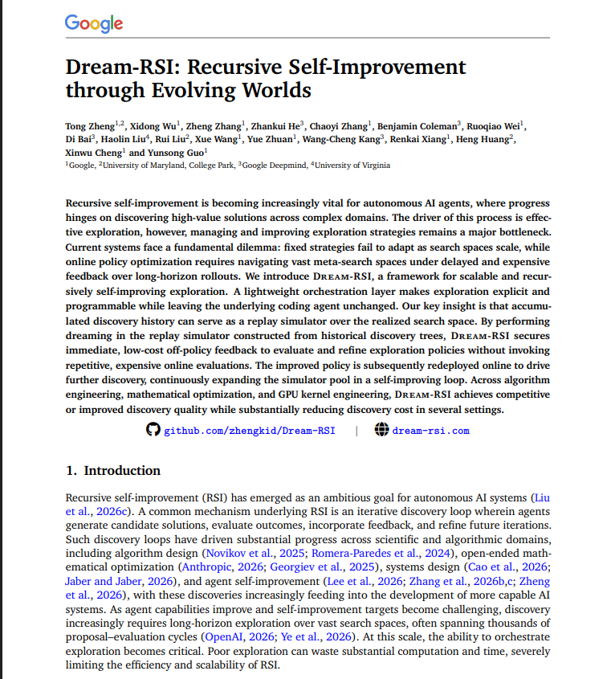
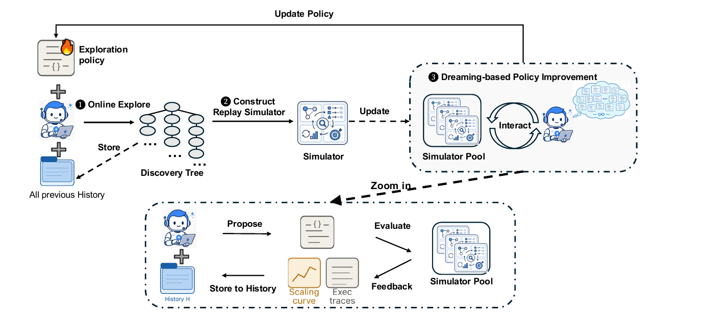

<div align="center">

# TRIE: Trading Recursive Intelligence Environment

Can an AI system improve the way it searches for trading strategies, and does that beat simply buying and holding?

[](https://www.python.org/)
[](./backtest.py)
[](./genome.py)
[](./data_nse.py)
[](./discovery.py)

[Plan](Plan.md) · [Recipes](./genome.py) · [Discovery loop](./discovery.py) · [Final experiment](./experiment_discovery.py) · [What we learned](#what-we-learned)

</div>

## Built around Dream-RSI

This project is built to test the idea from Google's paper **[Dream-RSI: Recursive Self-Improvement through Evolving Worlds](https://dream-rsi.com)** (Zheng et al.; [code](https://github.com/zhengkid/Dream-RSI)).



The paper's idea: searching for good solutions is expensive, mostly because every attempt is tried for real. Dream-RSI keeps the history of all past attempts and uses it as a cheap replay simulator, a "dream". Different ways of searching are tried inside the dream, the best one is used for real, and the new results make the dream better.

We did not copy the paper. We built a **trading environment** (real NSE stocks, real costs, train / validation / test periods, buy-and-hold as the opponent) and plugged this loop into it, to see how it changes the results.

> [!NOTE]
> "RSI" here means *recursive self-improvement*, not the stock indicator (Relative Strength Index).



| Paper | Ours |
|---|---|
| Online explore, store in a discovery tree | Backtest candidate strategies, keep every result and which parent made it |
| Construct replay simulator | Fit a cheap model of "strategy recipe → score" on that history |
| Dreaming-based policy improvement | Try hypothetical modifications inside the model, learn which kinds help |
| Update policy | The improved policy picks the next batch of real backtests |

## What we did

**1. Fake data baseline.** On 100 random price charts, a simple moving-average rule lost 12.2% on average, almost exactly the 12.6% it paid in trading costs ([experiment_ab.py](experiment_ab.py)). Random charts have nothing to find, and one chart tells you almost nothing.


**2. Real data.** 48 big NSE stocks (Nov 2017 to Oct 2026) with real Zerodha and Groww delivery costs (about 0.24% per buy+sell round trip, mostly tax). The moving-average rule and a shape-matching rule both lost to buy-and-hold, because they trade too often and costs eat the profit. 

> [!IMPORTANT]
> **Buy-and-hold is the bar to beat,** not the model we built. A strategy only counts if it beats holding on data it never saw, after costs.

**3. Searching for strategies (48 stocks).** Four ways of searching, each given 200 backtests, averaged over 20 runs ([rsi_search.py](rsi_search.py), [dream_rsi.py](dream_rsi.py)). The best strategy found on the first half of the data was tested on a later period it never saw. Strategies had 7 settings, including a minimum holding time and cooldown. Without those, they traded about 100 times per stock and lost about 7%, because costs ate the profit.

| | Score on data it searched (Sharpe) | Test return | Test Sharpe | Beat buy-and-hold |
|---|---|---|---|---|
| Random search | 1.55 | -0.4% | -0.04 | 2 of 20 |
| Evolution | 1.72 | -1.7% | -0.19 | 1 of 20 |
| RSI (adapts its own search) | 1.73 | -0.6% | -0.06 | 2 of 20 |
| **Dream-RSI** | **1.87** | -0.6% | -0.04 | 0 of 20 |
| Buy and hold | n/a | +3.2% | 0.18 | n/a |

Dream-RSI found the best strategies fastest, but they were no better on unseen data. Finding the best score on the past faster just means fitting the past faster.

> [!NOTE]
> These scripts now load 200 stocks by default. The numbers above are from the original 48 and were not re-run.

**4. The full environment (200 stocks).** Strategies became readable recipes ([genome.py](genome.py)): 1 to 3 rules like "momentum(60d) in the top 30% of stocks", an optional market filter, a rebalance schedule, position sizing and a risk limit (max 5% per stock). They are scored after real costs on Sharpe, drawdown and turnover, and tested for no-peeking ([test_genome.py](test_genome.py)). Strategies are kept as a tree and the best of each *kind* is stored, to keep diversity ([discovery.py](discovery.py)).

Four searches with the same 300 backtests and same starting point, adding one ingredient at a time. Averages over 30 runs on the unseen test period (Jul 2024 to Oct 2026, [experiment_discovery.py](experiment_discovery.py)):

| Search | Test Sharpe | Test return | Max drawdown | Beat buy-and-hold (Sharpe) | New strategies better than their parent, early → late |
|---|---|---|---|---|---|
| Fixed (every change equally likely) | -0.09 | -1.2% | -8.5% | 9 of 30 | 34% → 29% |
| Online (learns from the last round only) | -0.05 | -0.6% | -7.4% | 10 of 30 | 34% → 32% |
| Replay (learns from all past history) | +0.11 | +0.9% | -7.6% | 13 of 30 | 34% → 31% |
| **Dream** (replay + imagined changes) | -0.02 | -0.6% | -7.5% | 11 of 30 | 35% → 31% |
| **Buy and hold** | **0.13** | **+1.7%** | **-21.1%** | n/a | n/a |

> [!CAUTION]
> A first version of this run was thrown out. Each chosen stock got a fixed tiny slice of money, so strategies sat mostly in cash and gamed the drawdown penalty. Chosen stocks now share the invested money (max 5% each), and the table above is the rerun.

## What we learned

- **No search beat buy-and-hold on return.** The searched strategies had much smaller drawdowns, but mostly because they sat in cash, and they earned about nothing.
- **Dreaming did not improve the search here.** Dream vs fixed was +0.07 Sharpe with a margin of error of 0.09, which is noise. The share of new strategies that beat their parent *fell* over the rounds for every search, so the search process did not get better. Replay beat fixed by 0.20 (about 2.4 margins of error), but with three comparisons that needs fresh runs to trust.
- **Overfitting is the real problem, not search speed.** The score on the data strategies were searched on is about 1.4, and on new data it is about -0.1 to -0.3 (same score, which combines Sharpe, drawdown and turnover).
- **Why it probably failed:** the five simple signals (momentum, volatility, volume surge, price vs average, closeness to a high) are well known and carry little edge after costs in this period. The test is only about 2.2 years, and the dream's model fits 300 noisy points in 26 dimensions.
- **If continued:** test over several rolling periods (walk-forward), and try richer signals such as market-wide ones. A null result is still an honest answer to the research question.

> [!WARNING]
> Caveats: one train/test split, and today's big companies only (survivorship bias flatters buy-and-hold). I also chose the fitness weights myself, and changed the sizing rule after seeing the first run.

## Run it

```
py data_nse.py                # download the NSE data into data/ (one time)
py test_backtest.py           # checks for the 1-stock backtester
py test_genome.py             # checks for the recipe backtester (including no-peeking)
py experiment_discovery.py 30 # the final comparison (about 10 minutes)
```

<div align="center">

[↑ Back to top](#trie-trading-recursive-intelligence-environment)

</div>
